---
author :
- Gabriele Fadini
title :
- I2C sensor monitor for RPi
theme :
- Copenhagen
colorscheme:
- Structure
font:
- professionalfonts
---

## Drone construction
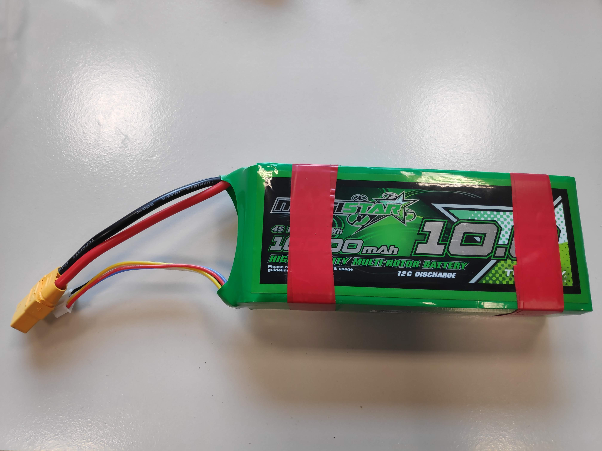

## Drone construction
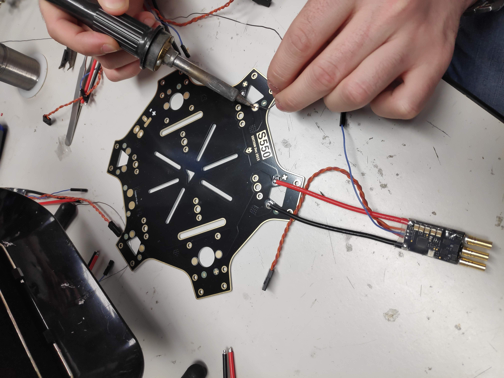

## Drone construction
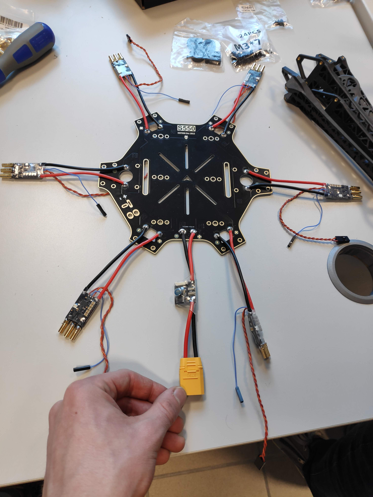

## Drone construction
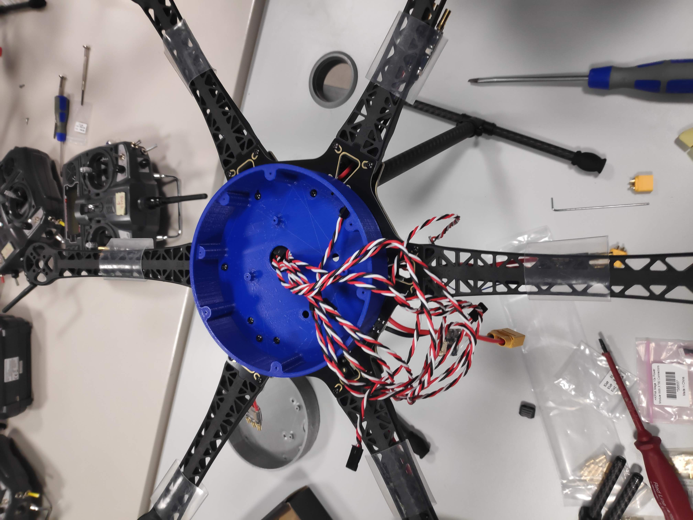

## Drone construction
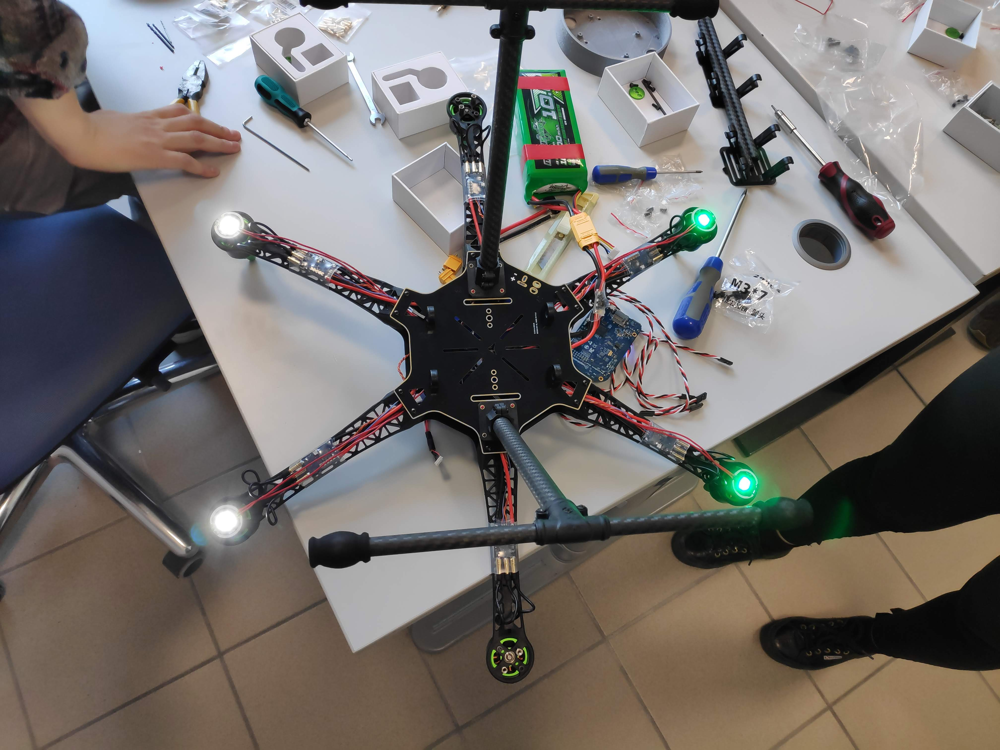

## Drone construction
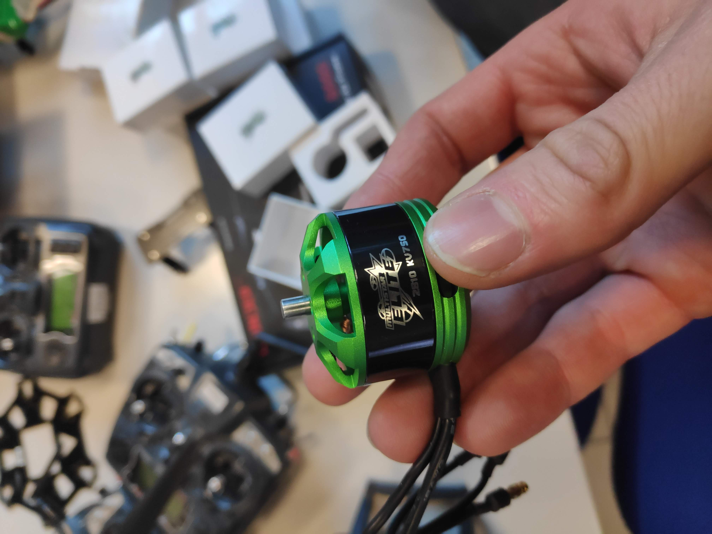

## Drone construction
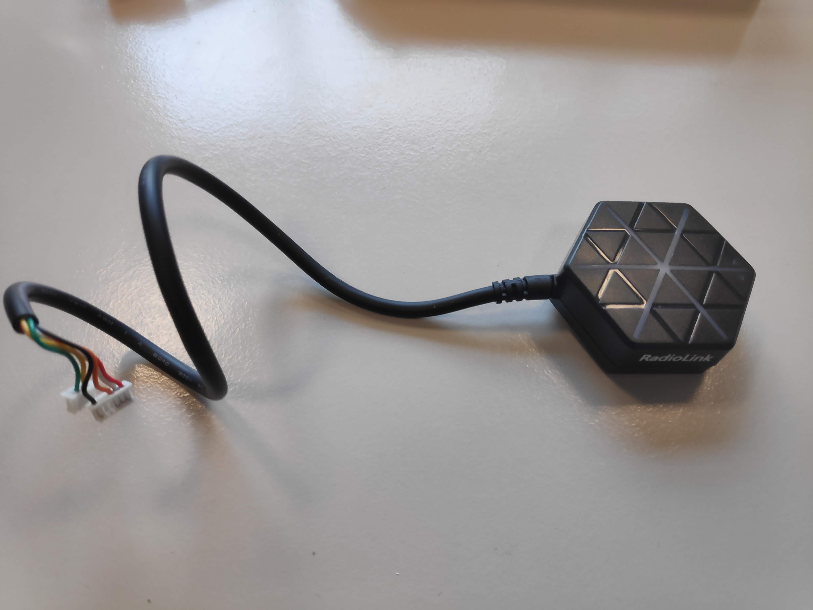

## Tips for the construction

- Solder ESC from battery on frame, **under 450°C**, in our configuration female connector on ESC, male on motor
- 3 states of motors are possible must see and configure with ardupilot, consider the **spin** orientation when mounting the motor
- consider always the spin rotation of each quad motor, on the inner side
- There are two possible frames types, depending on the number of motors
  - **S550**
  - **S500**
- Please consider that
  - **Xt60** connector can withstand 60 A max
  - **Xt90** connector can withstand 90 A max


## Connecting the Pixhawk and RPi
This report explains how to connect and configure a **RPi** so that it is able to communicate with a Pixhawk flight controller using the MAVLink protocol over a serial connection. This can be used to perform additional tasks such as sensor reading elaboration by using the I2C communication protocol.
So the outline is the following:

- connect the **RPi** to the flight controller and ground station
- implement the I2C communication on **RPi**

## Software implementation

There's a python process that manages the swarm of drones, sends commands through Mavproxy and MAVLink to the RPi and those commands are sent transmitted by the RPi to the flight controller (Pixhawk).
This process uses port forwarding, since the UDP protocol doesn't support multiport except with splitting.
Be careful that all the port number are assigned by the Python code running on the ground station, there's little to do by software on
the drone platform **see better the convention used in the documentation of Gemma and DroneGarage** readme and GemmaThesis.pdf in swarm_test_rpi folder.

Commands are sent via **UDP**, a faster but can only be split in port forwarding

Each linux board (BBBlue or RPi) has a fixed ip set up by the router, see the other documentation to know more.
The ground pc that sends the commands to the RPi has to be always on 192.168.02 for the code to properly work.

## TCP
The **Transmission Control Protocol** (TCP/IP) provides reliable, ordered, and error-checked delivery of a stream of octets (bytes) between applications running on hosts communicating via an IP network. 
This connection protocol is thus more suitable for slower rate communications and in our application is used for 
transmitting the data from sensors.

## UDP
Applications that do not require reliable data stream service may use the **User Datagram Protocol** **UDP**, which provides a service that emphasizes reduced latency over reliability.
UDP uses a simple communication model with a minimum of protocol mechanisms. It has no handshaking dialogues, and thus exposes the user's program to any unreliability of the underlying network; there is no guarantee of delivery, ordering, or duplicate protection. It is better suited to high performance communication, where latency is crucial.

## SSH
Secure Shell **SSH** is a crypto network protocol for operating network services securely over an unsecured network. 

Typical applications include remote command-line, login, and remote command execution, but any network service can be secured with SSH.

We can use the SSH to run the programs by remote on the RPi. In particular we'll open a terminal on the  RPi and run the commands on it, in the case of the sensor Python code, the terminal will show the converted and formatted readings of the sensors.

## Ardupilot
This program comes really useful to set up the drones individually, and to track the swarm. Moreover it has visualization of the mission capabilities.

Please note that some safety check has to be disabled on some parameters, otherwise the drone cannot go in the ARMED state.

- to set this communication is necessary to enable the serial communication with the RPi serial at 15200 baudrate
- to set up MAVlink on the RPi

## Setting the Pixhawk by PC

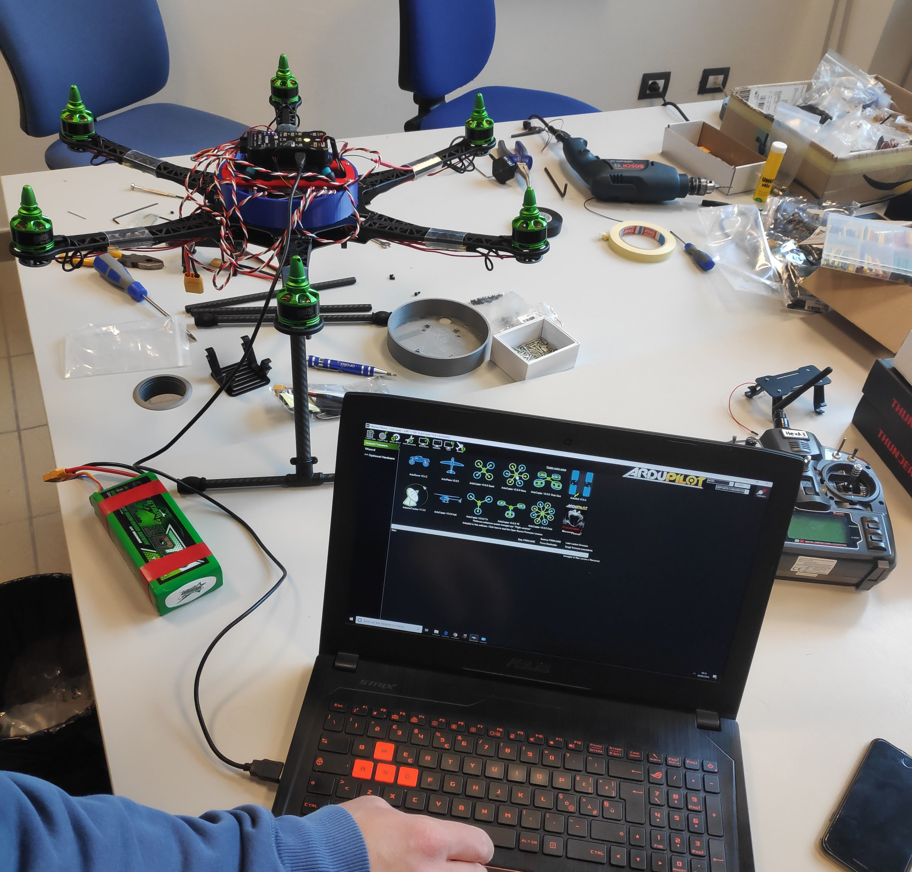

## Hardware set up (Pixhawk calibration)
### Mandatory

- Frame type
- Level and calibrate the accelerometers
- Compass calibration by rotating on the 3 axis
- GPS no fix , otherwise cannot work in enviroments without GPS
- Radio calibration to set the levels on the RC levers. Sets up the maximum and minimum 
- ESC calibration (unplug and plug back in, press the safety switch if attached to run the calibration), mesures the max and synchronizes, calibrates them
- Flight mode
- Fail safe per battery and radio signal loss (enables the return to land or the return if the signal is lost)

## Hardware set up (Pixhawk calibration)
### Optional

- Battery monitor (fail safe also on the battery charge)

- Failsafe are also settable from dronekit, and thus via the python code

- Set simple mode

## Other behavior that can be set

- **Rate loiter** to keep the trajectory

- **Speed** to be used for the  waypoints 

- **Behaviour** with respect to the waypoints, can be modified freely (e.g. seek, forward, around)

NOTES: 

- RC control has priority on the other commands and set flight mode

- Return to land and stabilize mode have to be planned carefully

## On Ardupilot

- Mission planner
     set thresholds and failsafe
- Battery check
     Charged, depending on the type and capacity
- Flight mode 
     If switch is used on the RC command, then the drone goes straight to land


## Setting up the **RPi**
  On the **RPi** was installed a version of the *Raspbian* or *Raspbian Lite* image. You need to install it and flash it as indicated on the *Raspbian* project site.
  
  If you needed to change the keyboard layout, since it was modified to IT, you can use the GUI command
  
  - ````sudo dpkg-reconfigure keyboard-configuration````
  - ````sudo setupcon````

## Connecting the Rasperry to the Pixhawk flight controller
Follow the wiring schematic and connect the power pins and **TX** and **RX**
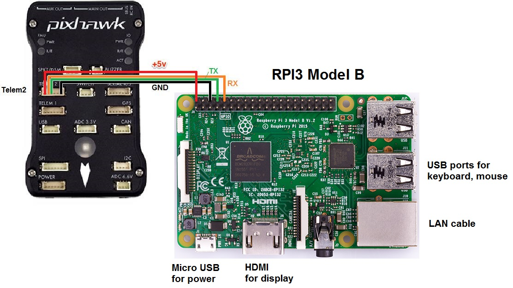

## In detail
Connect the Pixhawk’s **TELEM2** port to the RPi’s Ground, **TX** and **RX** pins as shown in the image above. More details on the individual RPi’s pin functions can be found [here](https://pinout.xyz).

The RPi can be powered by connecting the red **V+** cable to the **+5V** pin (as shown above) or from USB in (for example, using a separate 5V BEC hooked up to the USB power).

In our case we use the battery as power source with the use of a DC-DC that regulates the voltage to the one that is required.


## Installing the required packages
- ````sudo apt-get update````    
- ````sudo apt-get install screen python-wxgtk2.8 python-matplotlib python-opencv python-pip python-numpy python-dev libxml2-dev libxslt-dev python-lxml````
- ````sudo pip install future````
- ````sudo pip install pymavlink````
- ````sudo pip install mavproxy````

## Disable the OS control of the serial port
Use the RPi configuration utility for this.

Type:

- ````sudo raspi-config````

And in the utility, select “Advanced Options”:

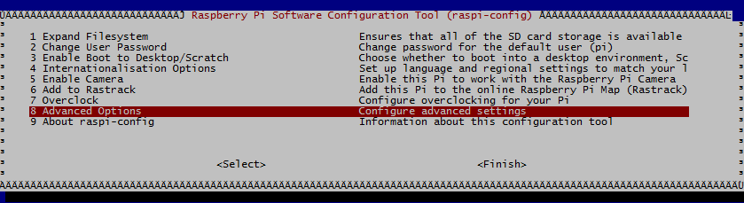

And then “Serial” to disable OS use of the serial connection

## Addition
In the latest Raspbian Stretch, these settings will be found in “Interfacing Options”. You may disable the *serial login shell* and *keep serial interface* enabled.

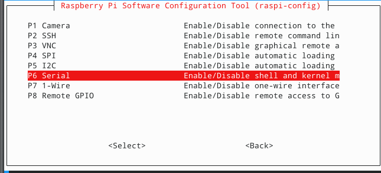

## Python code on ground station
- connect from script
- get telemetry information
- asynchronous notifications
- UAV to specified position (guided mode)
  - send arbitrary messages to control **UAV** or other hardware
- override the RC channel settings

## Connections
The connection will use the UDP protocol to fetch the command from the ground station and will sent them to the serial line to the flight controller.
To do this we need to install *dronekit*, a Python library

- ````pip install dronekit ````
- ````pip install dronekit-sitl````
- ````dronekit-sitl copter````

(required python2.7, python-pip and python-dev)

## Testing the connection
To test the RPi and Pixhawk are able to communicate with each other (even without ground station) first ensure the RPi and Pixhawk are powered, then in a console on the RPi type:

````sudo -s````

````mavproxy.py --master=/dev/ttyAMA0 --baudrate 921600 --aircraft MyCopter````

Once MAVProxy has started you should be able to type in the following command to display the ````ARMING_CHECK```` parameters value

## Setting autoconnection

Moreover to autostart the connection of the RPi with the modem, it's advisable to modify the ````/etc/wpa_supplicant/wpa_supplicant.conf```` file with the password and SSID of the WiFi connection.

For example, by adding:

````
network={
    ssid="testing"
    psk="testingPassword"
}
````

In case there's no password on the network use the ````key_mgmt=NONE```` option instead of the  password.
From the modem configuration page, set a fixed and unique address to the RPi.


## Setting mavproxy to start by default

We modify the .bashrc file in the $HOME path in order to autostart the mavproxy.py by default and connect to the ground station.

````bash
  #!/bin/bash
  (
  date
  echo $PATH
  PATH=$PATH:/bin:/sbin:/usr/bin:/usr/local/bin
  export PATH
  cd /home/pi
  screen -d -m -s /bin/bash 
  mavproxy.py --master=/dev/ttyS0 --baudrate 115200 --o$
  ) > /tmp/rc.log 2>&1
  exit 0
````

## Setting on fixed IP

We then have to go on the modem page to set a fixed IP to each drone according to the convention used in the previous work, in order to split correctly the UDP port for various services.

## Setup of a test on land
Now the set up is complete and a test can be done in the open with the working program.

Carry the modem with a battery power in order to have a stable WiFi connection, use a DC-DC to increase stability of power source.
Dispose the drones on land at their starting positions.

Power up them and let them autoconnect to the modem via their uniquely assigned IP

## Modem
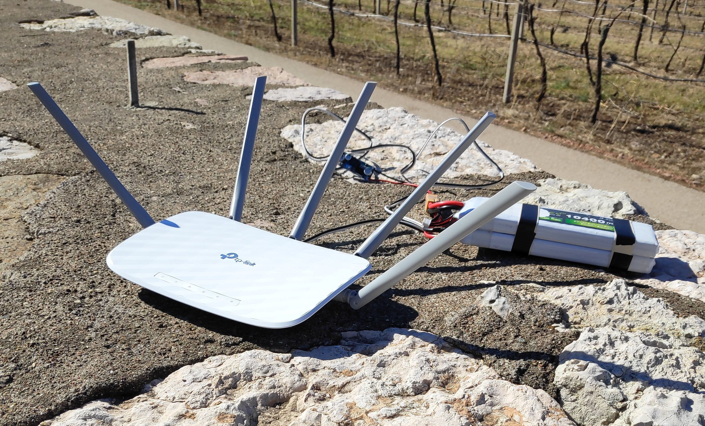

## Drones in the field test
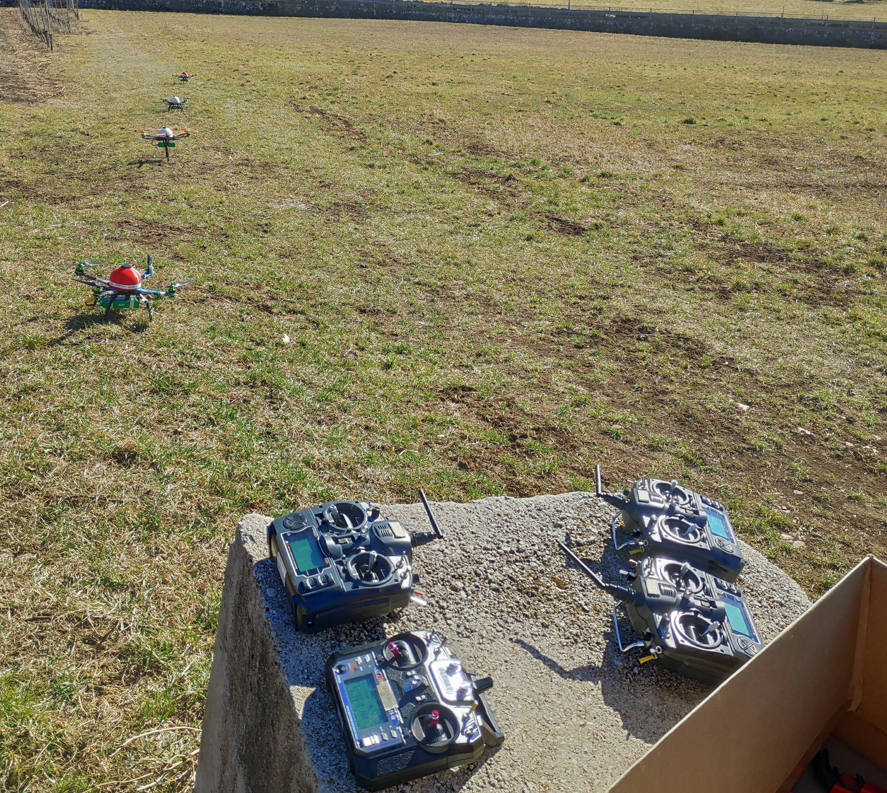

## I2C

  - Simple, for low manufacturing cost peripherals
  - "plug and play" **Serial Presence Detect (SPD) EEPROMs** on dual in-line memory modules (DIMMs)
  - System management for PC systems via SMBus
    -  **SMBus** pins are allocated in both Conventional PCI and PCI Express connectors
  - Lot of advanced libraries for **RPi**
  - Accessing low-speed **DACs** and **ADCs**

A strength of I2C is the capability of the implementation of a $\mu C$ to control for a network of device chips with just two $GPIO$ pins and software. Many other bus technologies require more pins and signals to connect multiple devices.

## Other significant features

  - **2 signal lines** are required, the **Serial Data SDA** line for the bidirectional transmission of data, and the **Serial Clock SCL** line, which is used to synchronize the data transfer.
  - Each device on the bus can act either as a master or a slave.
  - It has true multi-master bus capabilities, including collision detection and arbitration if two or more master devices activate at once
  - On-chip noise filtering is built in as standard.
  - devices with different logic families can be intermixed on the bus, and that a large number of devices can be added to a single bus. In theory, up to **128** devices

## Other features

  - **Broadcom Serial Controller (BSC)**, which supports 7-bit/10-bit addressing and bus frequencies of up to 400 kHz
  - The I2C bus on the RPi is 3.3 V tolerant, may need logic-level translation circuitry if you want to connect 5V powered I2C devices.
  - there's an additional I2C bus that can be enabled from the config file
  - the I2C bus 1 has already a pull-up resistor

## Workflow

  - the I2C has to be enabled on the **RPi**
  - connection to the RPi thanks to the SSH protocol
    - finding the devices on the network with nmap
      - e.g.
        ````sudo nmap -sP 192.168.1.0/24 | awk '/^Nmap/{ip=$NF}/B8:27:EB/{print ip}'````

        will scan all the adderesses of the peripheral on the subnet and find the RPi
    - we then use
        **ssh pi@address**
        and login to the raspberry with the default password ````raspberry````
  - launch the program to start the data capture


## Enabling I2C on RPi

  - ````cd /boot````
  - ````nano config.txt````
  - add string ````dtparam=i2c\_arm=on```` and save
  - ````sudo reboot````

## Enabling I2C on RPi

  - ````cd /dev````
  - ````sudo modprobe i2c-bcm2708````
  - ````sudo modprobe i2c-dev````
  we will use the first bus, with pull-up resitor, the other one can be enabled, but has to use resistors.

## Enabling the modules 

Instead of loading the modules manually, you can edit the **/etc/modules** file and add the module names to it

- ````snd-bcm2835````
- ````i2c-bcm2708````
- ````i2c-dev````
 
  The ````I2C LKMs```` will then by automatically loaded on boot. 

- check the module is loaded with 

  ````lsmod | grep i2c````


## Installing the line command

Now we proceed with the installation of ````i2c-tools````, an utility for I2C communication from command line:

  -  ````sudo apt install i2c-tools````


## Description of I2C tools

We use the following functions:
  - ````i2cdetect -y 1````

    searches for the connected devices

  - ````i2cget -y 1 dev_address data_register````

    allows to read the value from the address

  - ````i2cset -y 1 dev_address data_register value````
    allows to send and write data on the register of the specified device address

## Changing the parameters

  - ````sudo cat /sys/module/i2c_bmc2708/parameters/baudrate````
  can change the baudrate, default this is 400kHz.

## Debugging the $I2C$

We can use the decoder tools of a digital oscilloscope to get the communication along the I2C
we use the *picoscope* by installing the program on Linux, otherwise follow the installer for Windows on the site

- **libps3000a**
- **picoscope**
- **libpaicaipp**

From that we can clearly see the addresses and values passed to them, so the verification of the setup is really easy, given the conversion capabilities of the digital oscilloscope.

## Testing with picoscope

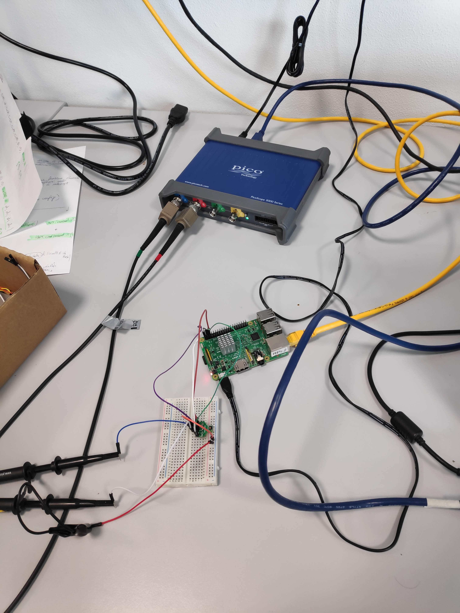

## Wiring Example

We simply need to:

- power the sensor by the means of the **3V3** and **GND** pins 
- connect **SDA** and **SCL** lines

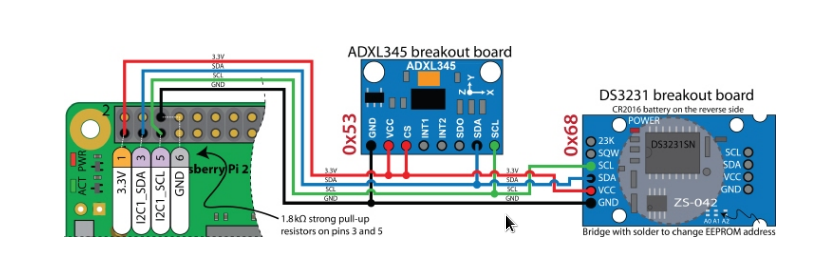

## Packages and libraries
 - we use the python package **SMBus** for the **RPi**, it comprises all the tools that are useful
 to establish a I2C communication with the board
 - later to also add the **master-slave** capability we will use the **PiGPIO** library instead
 - the timestamp for the printout are obtained by the $time$
 - the calls to the **RPi** are done by the $system$ module
    this enables us to use the standard Linux functions on the terminal
 - in particular we will use the function ````i2cdectect```` to know what addresses are used.


## How the program is structured
  - program launches ````i2cdetect 1 -y```` to scan the devices connected to the **bus 1**
  - if the sensor device address **0x04** (gas sensor) is found, we can start the transmission of data
  - the reading is received thanks to ````bus.read_bytes('gas_type')````
  - The program uses the values read form the device addresses in conversion formulas that are user/producer defined
  - The converted values are chronologically saved in a log file on the **RPi** and cast to terminal that is connected trough **ssh**
  - write data to the addresses if needed by other functions

## Python dictionaries
  Each slave device attached to the bus is preassigned an unique address, which is in either *7-bit* or *10-bit* form.

  In the following examples, *7-bit* addressing is used, i.e., **0x00** to **0x7F**.

  - It makes sense to use the table in a more direct way in the functions
  - Python dictionaries are directional tables that can easily implement conversion form addresses to their "actual meaning"
  - ex. **read('gas_value')** instead than **read(0x02)**

## Example of dictionary
  ````python
  dict = {'Name': 'Zara', 'Age': 7, 'Class': 'First'}

  print "dict['Name']: ", dict['Name']

  print "dict['Age']: ", dict['Age']
  ````

## Inverting the dictionaries
  The dictionary is reverted thanks to a specific function that flips the two entries and appends it to the original dictionary.

  ````python
  def add_inverse_dictionary(dictionary):
    inverse = {v : k for k, v in dictionary.iteritems()}
    dictionary.update(inverse)
  ````

## Conversion function
  The conversion of binary values to their real value is heavily dependant on the construction of the sensor and the needs of the user. So it's difficult to provide a general library. We mainly need

  - use binary reads
  - convert binary to numbers or string
  - perform bitwise operations
  - compare them thanks to the dictionary to other kind of values

  All of that is mainly done thanks to Python type conversion and builtin libraries that are quite versatile in that regard.

## Python bitwise operators
- ```` x << y````

  Returns x with the bits shifted to the left by y places (and new bits on rhs are zeros), same as multiplying x by 2**y.

- ```` x >> y````

  Returns x with the bits shifted to the right by y places. This is the same as dividing x by 2**y.

- ```` x & y ````

  Does a "bitwise and". Result bit 1 if the corresponding bit of x AND of y is 1, otherwise it's 0.


## Python bitwise operators

- ```` x | y ````

  Does a "bitwise or". Each bit of the output is 0 if the corresponding bit of x AND of y is 0, otherwise it's 1.

- ```` ~ x ````

  Returns the complement of x 

- ```` x ^ y````

  Does a "bitwise exclusive or". Each bit of the output is the same as the corresponding bit in x if that bit in y is 0, and it's the complement of the bit in x if that bit in y is 1.


## Two's complement
Two's complement is a mathematical operation on binary numbers. It is used in computing as a method of signed number representation.
For a $N$ bit number $A_{N-1}A_{N-2}...A_{0}$ expressed in MSB we have
$$value_{10}=-A_{N-1}2^{N-1}+\sum_{i=0}^{N-2}A_{i}2^{i}$$

## Python code
Calculates a two's complement integer from the given input value's bits

````python
  def twos_complement(input_binary, num_bits):
    mask = 2**(num_bits - 1)
  return -(input_binary & mask) + (input_binary & ~mask)
````

## Connect two RPi master-slave with I2C
With the library PiGPIO we'll simulate a master slave communication through GPIO

### Preparations
Be sure to have commented out this line in your ````/boot/config.txt````:

````dtparam=i2c_arm=on````

### Dependencies
Next, install ````g++```` and ````pigpio```` using this command:

````sudo apt install g++ pigpio````

## Pins
The BSC peripheral uses GPIO 18 (SDA) and 19 (SCL) in I2C mode and GPIO 18 (MOSI).
You need to swap MISO/MOSI between master and slave.


## Connect the two RPi

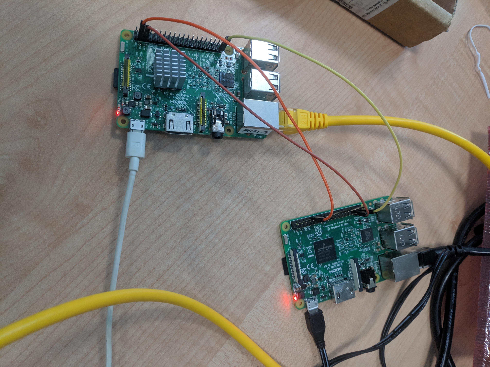

## Library PigGpio

Setting the RPi as a slave uses the class ````bscXfer```` from the ````PiGpio```` library.

In the source code, the data in the ````bsc_xfer_t```` struct are used add or receive messages but those are only applied when ````bscXfer```` is executed with the address to the struct.

The ````bsc_xfer_t.control```` integer has a fairly special role which states multiple things like slave I2C address, and various other states that are documented in the site.

## Source code
The address can be changed to whatever you want (as long as it is not above ````127````, in hex  ````7F````).
It is recommended to run the ````closeSlave```` function upon finishing your testing.

## Run the example

### Compile with

- ````g++ slaveTest.cpp -lpthread -lpigpio -o slaveTest````

### Execute it 
 
-  ````sudo ./slaveTest````

## Test example

By running a script that uses the **SMBus** library on python from master we test the connection.  We are able to trasmit data from the master to the slave and show it on the serial.
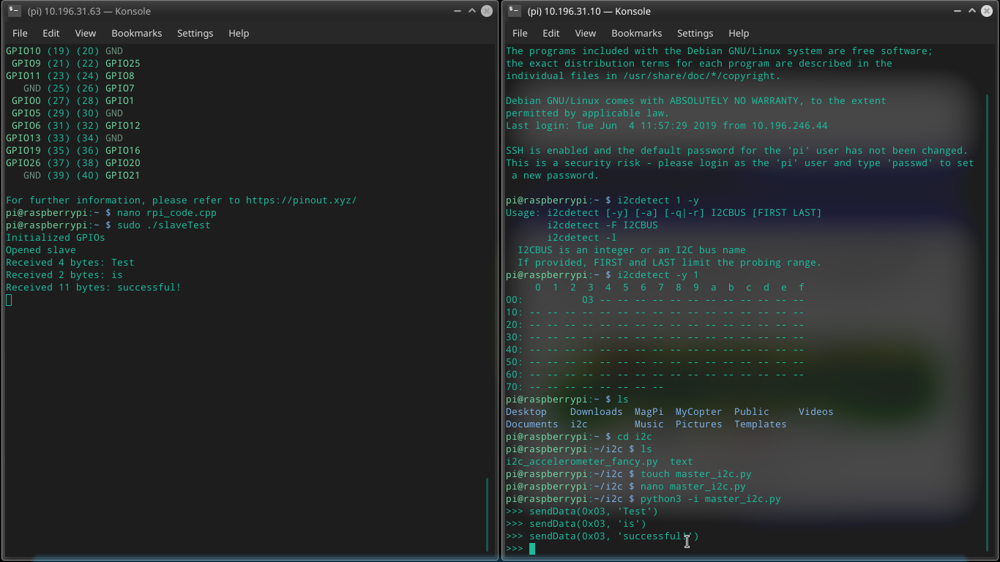